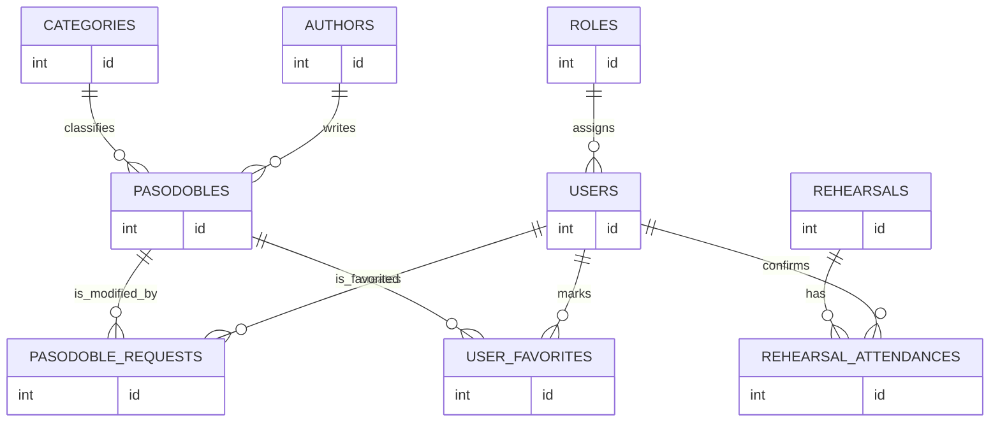
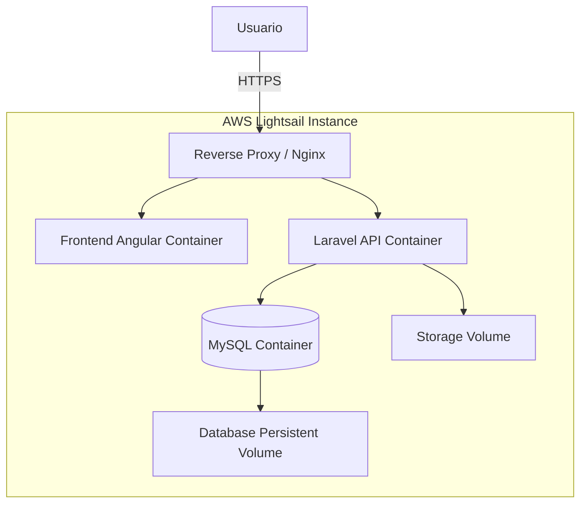

# PASODOBLES API

> **Nota de despliegue:**  
> El despliegue definitivo de la aplicación se encuentra actualmente en proceso.  
> La arquitectura prevista contempla una publicación mediante **Docker** sobre **AWS Lightsail**. Mientras tanto, este README incluye una guía de ejecución local desde una carpeta `.zip`.

---

## Ejecución local desde `.zip`

Esta guía permite levantar el proyecto en local partiendo de una carpeta padre comprimida que contenga el backend Laravel y el frontend Angular.

### Estructura esperada

```txt
pasodobles-project/
│
├── backend/
│   ├── app/
│   ├── database/
│   ├── routes/
│   ├── composer.json
│   └── ...
│
├── frontend/
│   ├── src/
│   ├── angular.json
│   ├── package.json
│   └── ...
│
└── README.md
```

### Requisitos previos

Es necesario tener instalado:

- PHP compatible con Laravel 12.
- Composer.
- Node.js y npm.
- Angular CLI.
- XAMPP o equivalente para MySQL.
- MySQL.
- Git, opcional pero recomendable.

Comprobaciones básicas:

```bash
php -v
composer -V
node -v
npm -v
ng version
```

Si Angular CLI no está instalado:

```bash
npm install -g @angular/cli
```

### Preparar base de datos local

1. Abrir **XAMPP Control Panel**.
2. Iniciar **Apache** y **MySQL**.
3. Entrar en `phpMyAdmin`.
4. Crear la base de datos vacía:

```bash
CREATE DATABASE pasodobles_mb;
```

Las tablas no se crean manualmente. Laravel las genera mediante migraciones.

### Configurar backend Laravel

Entrar en la carpeta del backend:

```bash
cd ./laravel-pasodobles
```

Instalar dependencias eliminadas del `.zip`:

```bash
composer install
```

Crear archivo de entorno:

```bash
cp .env.example .env
```

En Windows PowerShell:

```powershell
Copy-Item .env.example .env
```

Generar clave de aplicación:

```bash
php artisan key:generate
```

Editar `.env` y configurar la conexión a MySQL:

```env
DB_CONNECTION=mysql
DB_HOST=127.0.0.1
DB_PORT=3306
DB_DATABASE=pasodobles_mb
DB_USERNAME=root
DB_PASSWORD=
```

Ejecutar migraciones:


```bash
php artisan migrate --seed
```

## Configurar XAMPP para usar `pasodobles.mb` en local

Durante el desarrollo local, el backend Laravel puede configurarse para funcionar con un dominio local personalizado en lugar de acceder mediante `http://127.0.0.1` o `http://localhost`.

En este proyecto se puede usar el host local:

```txt
pasodobles.mb

Abrir como administrador:

```txt
C:\Windows\System32\drivers\etc\hosts
```

Añadir al final del archivo:

```txt
127.0.0.1 pasodobles.mb
```

Abrir el siguiente archivo de configuración:

```txt
C:\xampp\apache\conf\extra\httpd-vhosts.conf
```

Pegar: ( configurar ruta de archivo real )

```bash
<VirtualHost *:80>
    ServerName pasodobles.mb
    DocumentRoot "C:\Users\XXXXXX\Downloads\pasodobles-api\laravel-pasodobles\public"

    <Directory "C:\Users\XXXXXXXX\Downloads\pasodobles-api\laravel-pasodobles\public">
        Options Indexes FollowSymLinks
        AllowOverride All
        Require all granted
    </Directory>
</VirtualHost>
```

Activar VirtualHosts Apache:

```txt
C:\xampp\apache\conf\httpd.conf
```

Descomentar esta línea: ( quitar # ):

```bash
Include conf/extra/httpd-vhosts.conf
```

Limpiar cachés Laravel:

```bash
php artisan config:clear
php artisan cache:clear
php artisan route:clear
```

La API estará disponible en la ruta: 

```text
http://pasodobles.mb/api
```
---

### Configurar frontend Angular

Abrir otra terminal y entrar en la carpeta del frontend:

```bash
cd ./angular-pasodobles
```

Instalar dependencias eliminadas del `.zip`:

```bash
npm install
```

Ejecutar Angular:

```bash
ng serve
```

La aplicación quedará disponible en:

```txt
http://localhost:4200
```

### Orden recomendado de ejecución

1. Iniciar Apache y MySQL desde XAMPP.
2. Comprobar que la base de datos existe.
3. Ejecutar Angular con `ng serve`.
4. Abrir `http://localhost:4200`.

### Problemas frecuentes

| Problema | Causa habitual | Solución |
|---|---|---|
| `vendor/autoload.php` no encontrado | Faltan dependencias Laravel | Ejecutar `composer install` |
| `node_modules` no encontrado | Faltan dependencias Angular | Ejecutar `npm install` |
| Error de conexión con DB | MySQL apagado o `.env` incorrecto | Revisar XAMPP y variables `DB_*` |
| Error 404 en API | Ruta incorrecta o Laravel no iniciado | Revisar `routes/api.php` y `php artisan serve` |
| Error CORS | Frontend y backend en puertos distintos | Configurar CORS o proxy Angular |

---

## Descripción del proyecto

**PASODOBLES API** es una aplicación web full-stack destinada a centralizar, formatear y consultar información musical relacionada con pasodobles, compositores y recursos internos de una agrupación musical.

El objetivo principal es sustituir información dispersa en documentos, archivos locales u hojas de cálculo por una plataforma única, estructurada y mantenible.

La aplicación distingue entre usuarios estándar y administradores, permitiendo tanto la consulta del archivo musical como la gestión interna de sus datos.

---

## Objetivos

- Centralizar información musical en una única plataforma.
- Normalizar datos sobre pasodobles, compositores y categorías.
- Facilitar la consulta rápida del archivo musical.
- Permitir la administración de contenidos desde un panel privado.
- Preparar la aplicación para funcionalidades internas como favoritos, solicitudes y ensayos.
- Mantener una arquitectura escalable y desplegable en entorno cloud.

---

## Tecnologías utilizadas

### Backend

El backend está desarrollado con **Laravel 12** y expone una **API REST** consumida por el frontend.

Tecnologías principales:

- PHP.
- Laravel 12.
- Laravel Sanctum.
- Eloquent ORM.
- Form Requests.
- Middlewares.
- Migraciones y seeders.
- Artisan CLI.

Laravel actúa como capa de negocio, autenticación, autorización, validación y persistencia.

### Frontend

El frontend está desarrollado con **Angular 21.2**.

Tecnologías principales:

- Angular 21.2.
- TypeScript.
- Standalone Components.
- Reactive Forms.
- HttpClient.
- RxJS.
- Bootstrap 5.
- SCSS personalizado.

Angular se encarga de la interfaz, navegación, formularios, consumo de API y renderizado de vistas públicas, privadas y administrativas.

### Base de datos

El proyecto utiliza **MySQL** como base de datos relacional.

Entidades principales:

- Usuarios.
- Roles.
- Pasodobles.
- Compositores.
- Categorías.
- Favoritos.
- Solicitudes o tickets.
- Ensayos.
- Confirmaciones de asistencia.

#### Diagrama simplificado de base de datos

> Diagrama orientativo. No muestra campos internos ni información sensible.



---

## Arquitectura del proyecto

La aplicación sigue una arquitectura cliente-servidor desacoplada.

```txt
Angular Frontend
        |
        | HTTP / JSON
        v
Laravel REST API
        |
        | Eloquent ORM
        v
MySQL Database
```

El frontend no accede directamente a la base de datos. Todas las operaciones pasan por la API de Laravel, que valida, autoriza y procesa cada petición.

---

## Arquitectura prevista de despliegue

El despliegue está planteado mediante **Docker** sobre **AWS Lightsail**.

```txt
AWS Lightsail Instance
│
├── Docker Network
│   ├── Frontend Container
│   ├── Backend Container
│   ├── Database Container
│   └── Reverse Proxy Container
│
└── Persistent Volumes
    ├── Database data
    └── Application storage
```



Esta arquitectura permite separar responsabilidades:

- Angular se sirve como aplicación web estática.
- Laravel expone la API REST.
- MySQL conserva los datos.
- Nginx o un reverse proxy centraliza el tráfico.
- Los volúmenes persistentes evitan pérdida de información al reconstruir contenedores.

---

## Funcionalidades principales

### Autenticación y roles

La aplicación incluye autenticación mediante Laravel Sanctum, persistencia de sesión y rutas protegidas según el rol del usuario.

Roles principales:

- **Usuario estándar**: consulta información y utiliza funcionalidades privadas.
- **Administrador**: gestiona datos desde el panel administrativo.

---

## Automatización y API externa

El proyecto incluye o contempla procesos automáticos para reducir trabajo manual.

Ejemplos:

- Aplicación automática de cambios al aprobar solicitudes.
- Notificaciones por email asociadas a solicitudes o eventos.
- Procesamiento estructurado de respuestas JSON.
- Integración con APIs externas para consumir información adicional.

---

## Herramientas de testing local

Estas herramientas se utilizan durante desarrollo y pruebas, pero no forman parte del stack principal de producción.

### XAMPP

Usado para levantar MySQL localmente y gestionar la base de datos mediante phpMyAdmin.

### Postman

Usado para probar endpoints, validar respuestas JSON, comprobar códigos HTTP y simular flujos antes de integrarlos en Angular.

### Caido

Usado para analizar tráfico HTTP entre frontend y backend durante pruebas controladas.

Permite revisar cabeceras, tokens, rutas protegidas, permisos reales en backend y comportamiento de la API ante peticiones manipuladas. Es especialmente útil para comprobar que las restricciones críticas se validan en Laravel y no solo en la interfaz.

---

## Autor

Proyecto desarrollado como parte de un proceso de aprendizaje, desarrollo y documentación progresiva de una aplicación web full-stack.
